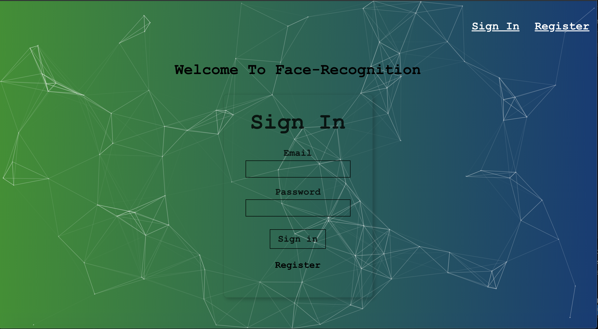

# Face - Recognition
*** Back end portion ***

Link to front end github: [Front-End](https://github.com/mawais54013/Face-Recognition)

The application is a image face recognition app using Postgres, React, Clarifai, and Tachyons. Users can login or register to the app and paste a link to a image in the input area that will detect every face in the image with a box while updating the user's count with every image. 


Sign-in and register page above

# Getting Started 

Site Link: [Face Recognition](https://face-recog01.herokuapp.com/)

After logging in or registering, the user will be taken to the main page where they can paste a link to a pic and after clicking the Detect button, the Clarifai API is used to detect a face in the picture. A demo in gif form in shown below with a link to a pic of Brad Pitt: 


### Prerequisites

Your can access the site from any interest browser including [Google Chrome](https://www.google.com/chrome/), [Firefox](https://www.mozilla.org/en-US/firefox/new/), or [Safari](https://www.apple.com/safari/). 

# Deployment 

This site is deployed through [heroku](https://codechat-v1.herokuapp.com/),and uses Postgres for storing login information about the users and the number of entries they make. 

# Built With 
* React.js 
* Javascript/JQuery
* Tachyons
* Postgres
* Clarifai
* Heroku
* NPM 
    - Particle.js
    - Express.js
    - Body-parser
    - bcrypt-nodejs
    - knex
    - cors

APIs and Libraries 

* [Tachyons](http://tachyons.io/)


    Create fast loading, highly readable, and 100% responsive interfaces with as little css as possible. CSS toolkit. 

* [Clarifai](https://clarifai.com/models/face-detection-image-recognition-model-a403429f2ddf4b49b307e318f00e528b-detection#documentation)

    Face detection API 


# Wireframe and Layout

Built with react as the front end and the back end is Node.js with Postgres for storing user information. The main design for this project is have show the user the number of faces in a image with a light blue box around the faces. With each image a user inputs, their count will be updated and stored in the database until their next image input. 

# Brief Features Descriptions


After send a API request with a image, the response sent back in form of JSON shows the number of faces in the image along with coordinates that put together will display a box around each face that is in the image while incrementing the user's count. 

```
calculateFaceLocation = (data) => {
    const image = document.getElementById('inputimage');
    const width = Number(image.width);
    const height = Number(image.height);
    return data.outputs[0].data.regions.map(face => {
        const clarifaiFace = face.region_info.bounding_box;
        return {
        leftCol: clarifaiFace.left_col * width,
        topRow: clarifaiFace.top_row * height,
        rightCol: width - (clarifaiFace.right_col * width),
        bottomRow: height - (clarifaiFace.bottom_row * height)
        }
    });
}
```

The function above get the response and uses map to make each face image have a top/bottom row and right/left column that will be used in the next function that will display the light blue boxes around each images. 

```


    {boxes.map(box => {
        console.log(box.topRow);
        return <div key={box.topRow} className='bounding-box' style={{top: box.topRow, right: box.rightCol, bottom: box.bottomRow, left: box.leftCol}}></div>
        })
    }
```

This displays the images and the map function is used to take the box coordinates and create a bounding box and place it in the image where the face is located. 

# Final Thoughts
Hope everyone enjoys this application, I had a really great time creating the project and I hope everyone will enjoy it too.

Thank you

# Author
* **Muhammad** - https://github.com/mawais54013